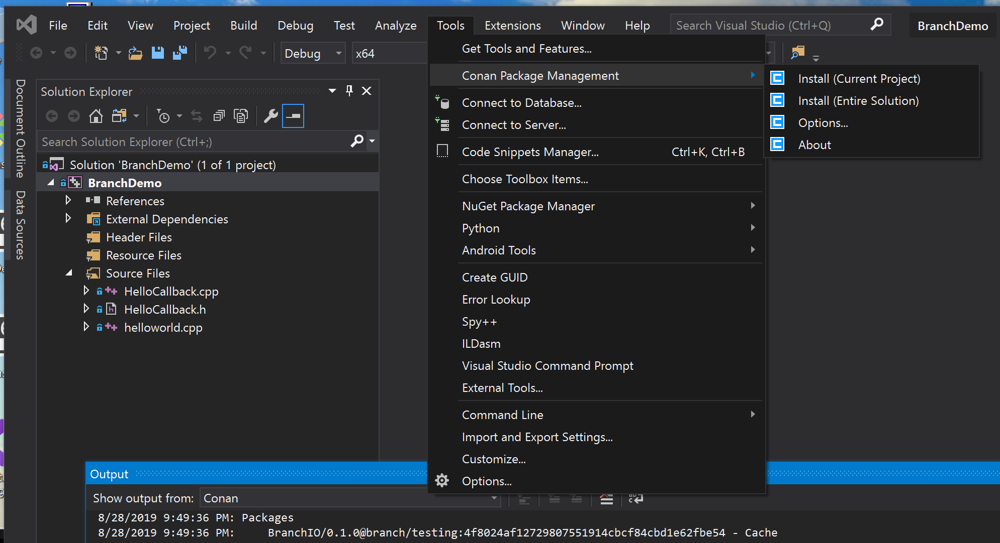
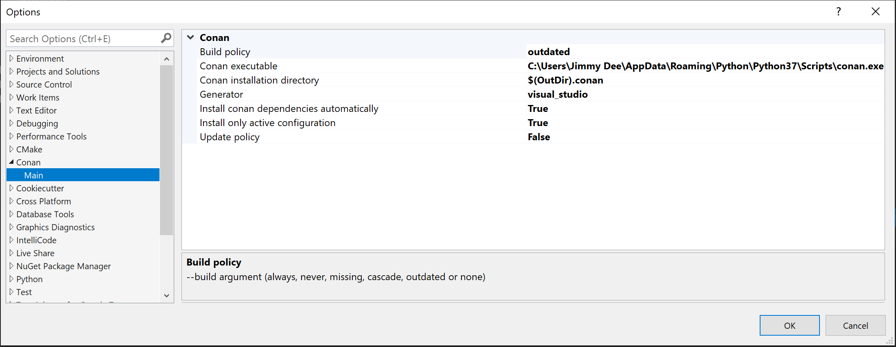
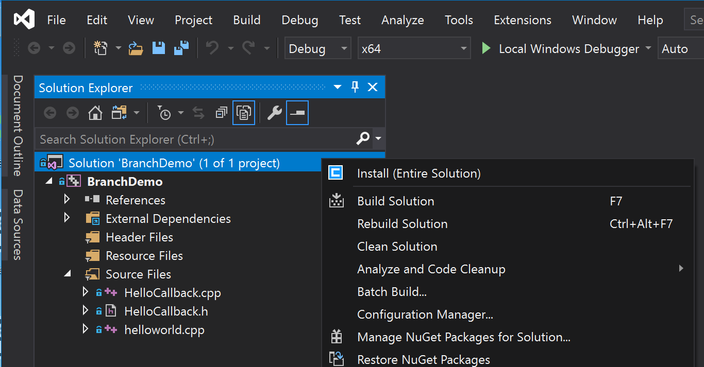
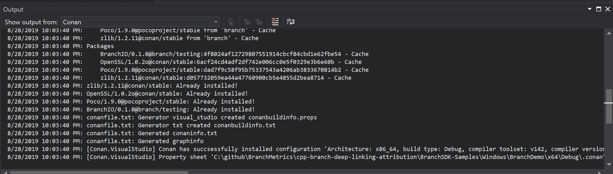
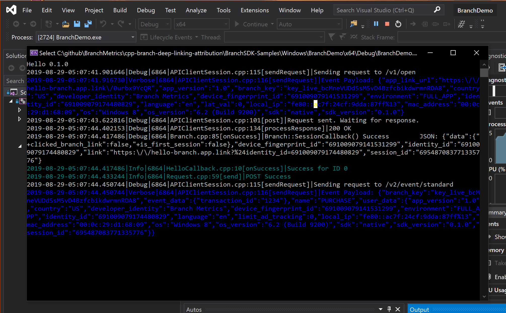

# BranchDemo app

The BranchDemo solution wraps the same source code as the [hello](../../console/hello) program.
It builds using the [Conan Visual Studio Extension](https://marketplace.visualstudio.com/items?itemName=conan-io.conan-vs-extension).

## Setting up the extension

Once you install the extension and restart Visual Studio, you will have a new
Tools submenu called Conan Package Management.



Select Options to set up the extension.



Enter the full path to your Conan executable. If you are using the Visual
Studio Python runtime, it will be under your home directory in
`\AppData\Roaming\Python\Python37\Scripts`. Note you need to include
`\conan.exe` at the end, not just the path to the binary.

Select Outdated for build policy.

## Building and running

The extension will usually install dependencies automatically. If not, trigger
installation from the Tools menu: Tools > Conan Package Management > Install (Entire Solution).
This option is also available in the context menu for the solution and
project.



Sometimes it is necessary to select this option twice.

You can see output from Conan in the Output window (View > Output or Alt-2).



Once Conan indicates a successful installation, you can simply click the Start
button to build and run in the local debugger.



## Note on binary builds in the Branch repo

Binary builds of the packages this SDK depends on are available from the Branch
Conan repository, but not from conan-center. If you use the Visual Studio
extension out of the box, it will always initially build OpenSSL, Poco and
gtest for any configuration that is not yet in the cache. To speed up this
process considerably, first put the following two-line conanfile.txt anywhere at all on
your Windows 10 host (not necessarily your project):

```
[requires]
BranchIO/0.1.0@branch/testing
```

After you [add the Branch remote](#set-up-branch-remote) and [set up a default profile](#set-up-a-default-conan-profile), just run:

```
conan install . -r branch --build BranchIO -s build_type=CONFIGURATION -s arch=ARCHITECTURE
```

from a Developer Command Prompt (not necessarily a Native Tools prompt) from the
directory containing conanfile.txt. CONFIGURATION is Debug or Release.
ARCHITECTURE is x86 or x86_64.

This will download all dependencies
prebuilt. The BranchIO package does not yet have binary builds available.
That will always be built locally from source and cached by Conan.

Building the dependencies takes time, though it is a one-time cost. After you
build locally, they will be cached. Manually running `conan install -r branch`
is much faster. This situation will doubtless evolve.
