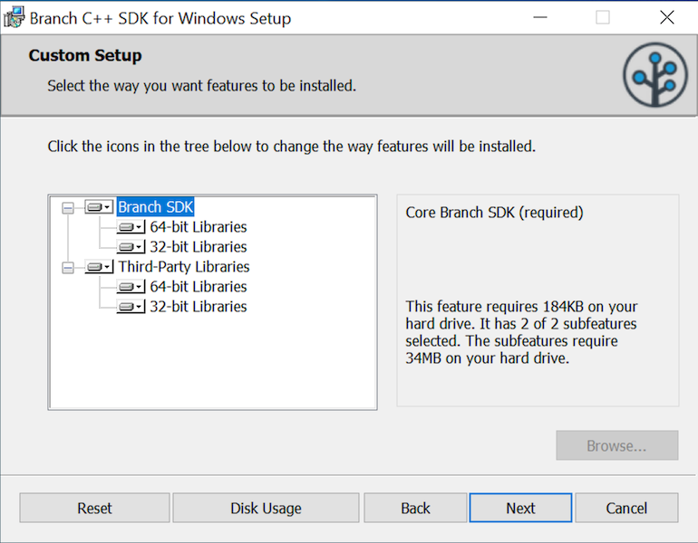
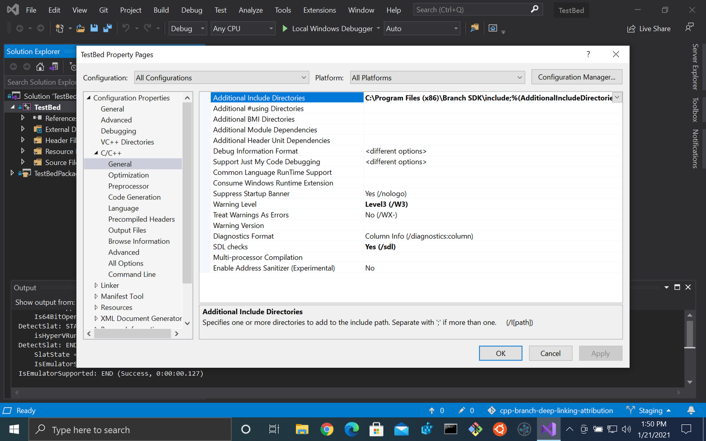
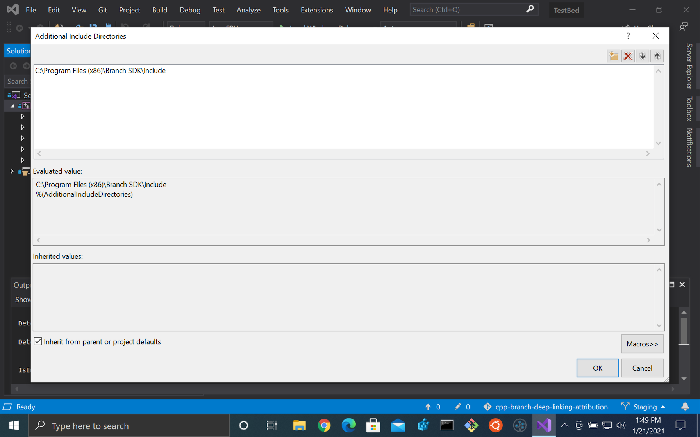
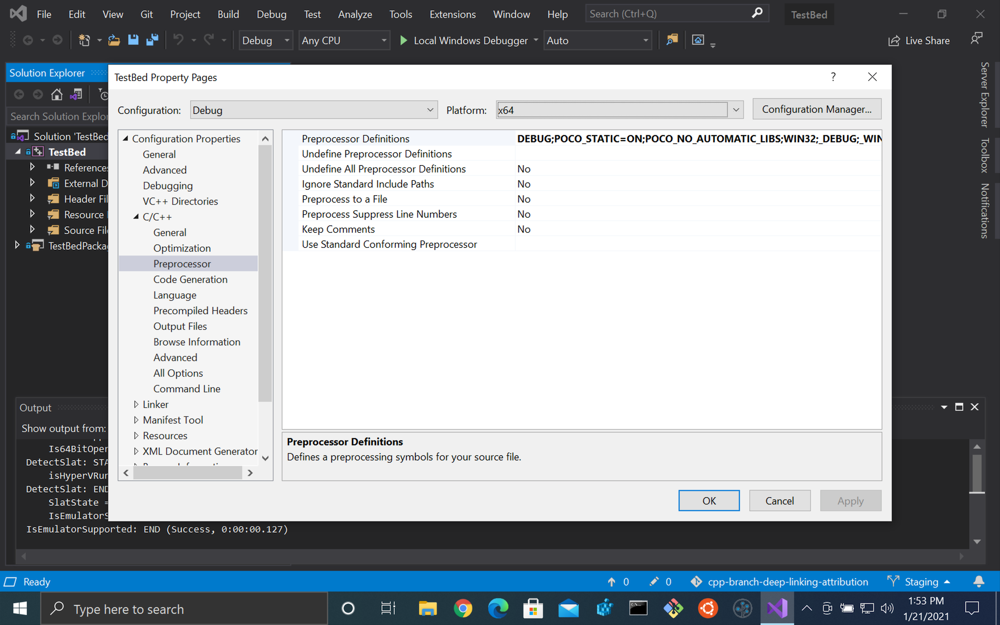
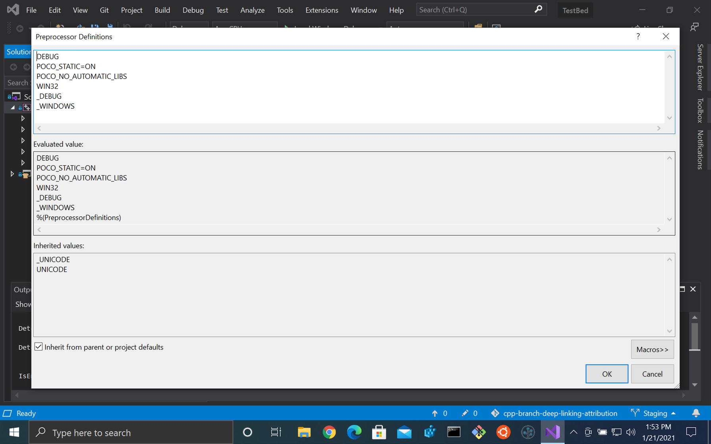
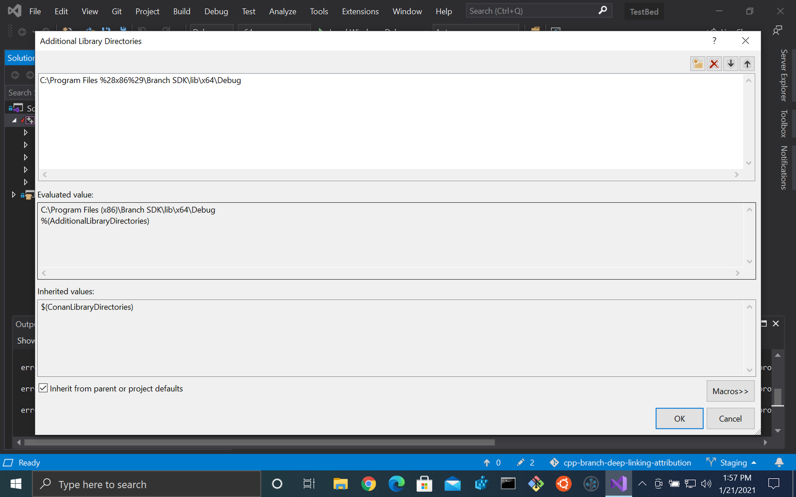
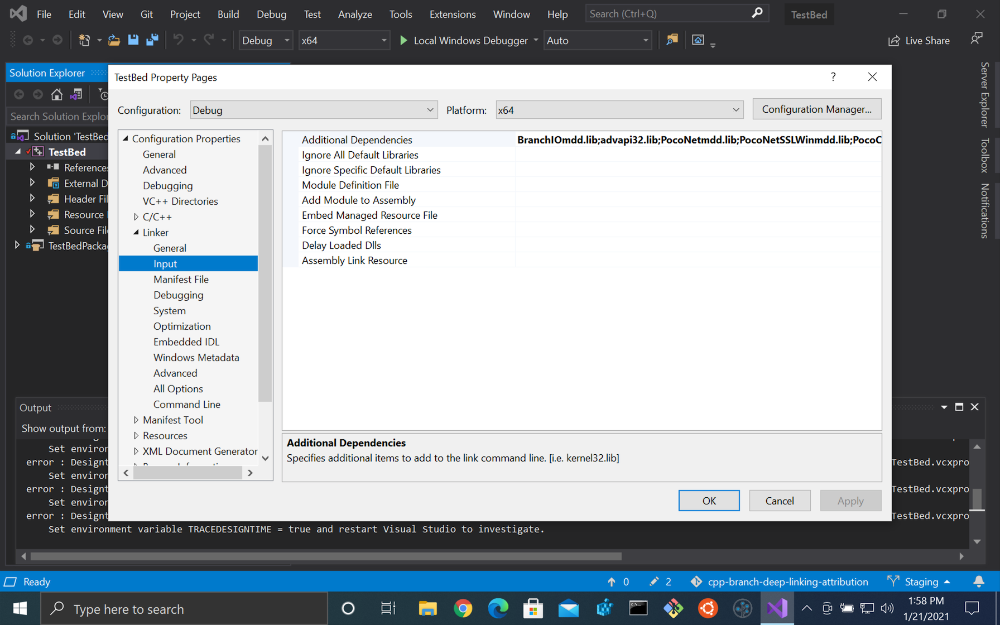
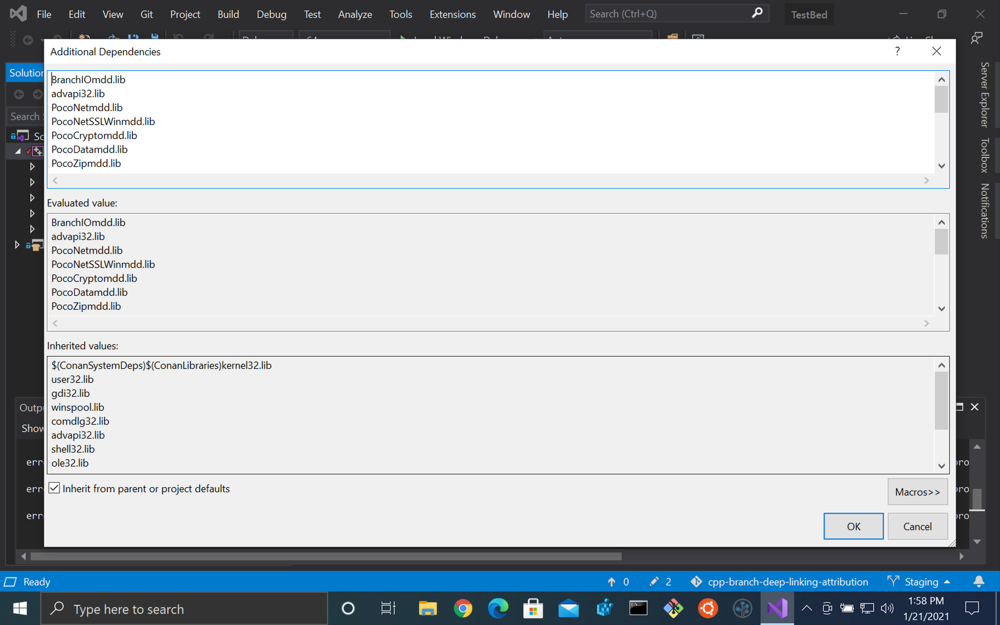

# \[DRAFT\] Branch C++ SDK for Windows Installation and Setup

**Note:**
This is draft documentation to replace the installation and setup instructions
through Section II of [Integrating the Branch SDK](https://help.branch.io/developers-hub/docs/windows-cpp-basic-integration#integrating-the-branch-sdk). No conanfile.txt is required.
Nothing after that should require major edits.

## Adding the Branch SDK to a Windows Solution

### Prerequisites

Visual Studio 2019 (Earlier versions are not supported.)

### Download the SDK

The Branch SDK Installer is available for download [here](https://github.com/BranchMetrics/cpp-branch-deep-linking-attribution/releases/download/1.2.0-rc1/BranchSDK.msi). This downloads a file called
`BranchSDK.msi`.

(_Note:_ Once released, we should be able to
replace this with a permanent unversioned URL to avoid updating with each
release.)

### Install the SDK

Double-click the `BranchSDK.msi` file to begin installation. The Branch SDK
requires Poco for HTTP, JSON and other purposes. Poco in turn requires openssl
and zlib. For convenience, these third-party libraries are included in the
distribution and will be installed alongside the Branch SDK.



It is recommended to use the included libraries for simplicity, but if you
already have them installed, you may exclude them here. Note also that 32-bit
and 64-bit binaries may be installed independently. By default, all will be
installed.

Once the installation finishes, all headers and libraries will be installed
under `C:\Program Files (x86)\Branch SDK`.

### Building against the installed SDK

The SDK will be installed in `C:\Program Files (x86)\Branch SDK`. The
following instructions assume you are using both x86 and x64. Omit any
instructions for an architecture you are not using.

Open your project's Properties in Visual Studio.

#### Add include path

Under `C/C++ > General`, add
`C:\Program Files (x86)\Branch SDK\include` to `Additional Include Directories`
for All Configurations and All Platforms.




#### Add preprocessor definitions

Under `C/C++ > Preprocessor`, add `POCO_STATIC=ON`, `POCO_NO_AUTOMATIC_LIBS` and
`WIN32` (for both x86 and x64) in `Preprocessor Defines`. Also define `DEBUG` in
Debug builds. All screenshots are for Debug x64 where configurations differ.




#### Add library paths

Under `Linker > General`, add the library directory for each combination of
configuration and platform to `Additional Library Search Paths`:
- Debug x64:
  C:\Program Files (x86)\Branch SDK\lib\x64\Debug
- Release x64:
  C:\Program Files (x86)\Branch SDK\lib\x64\Release
- Debug x86:
  C:\Program Files (x86)\Branch SDK\lib\x86\Debug
- Release x86:
  C:\Program Files (x86)\Branch SDK\lib\x86\Release




#### Add libraries

Under `Linker > Input`, add the following (in order) to `Additional
Dependencies`, depending on the configuration:

Debug:
```
BranchIOmdd.lib
advapi32.lib
PocoNetmdd.lib
PocoNetSSLWinmdd.lib
PocoCryptomdd.lib
PocoDatamdd.lib
PocoZipmdd.lib
PocoUtilmdd.lib
PocoXMLmdd.lib
PocoJSONmdd.lib
PocoFoundationmdd.lib
Iphlpapi.lib
Crypt32.lib
ssleay32.lib
libeay32.lib
crypt32.lib
msi.lib
ws2_32.lib
zlib.lib
```

Release:
```
BranchIOmd.lib
advapi32.lib
PocoNetmd.lib
PocoNetSSLWinmd.lib
PocoCryptomd.lib
PocoDatamd.lib
PocoZipmd.lib
PocoUtilmd.lib
PocoXMLmd.lib
PocoJSONmd.lib
PocoFoundationmd.lib
Iphlpapi.lib
Crypt32.lib
ssleay32.lib
libeay32.lib
crypt32.lib
msi.lib
ws2_32.lib
zlib.lib
```




Your app should now build and run.

Continue to integration in the next section (Section III of [Integrating the Branch SDK](https://help.branch.io/developers-hub/docs/windows-cpp-basic-integration#integrating-the-branch-sdk)).
